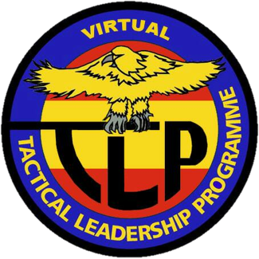

# vRF-briefing
Wellcome to the virtual Tactical Leadership Program pages hosted by the spanish squadron [GV5JS](http://foro.gv5js.com/). Virtual TLP offers to the participants the oportunity to fly combat training missions in DCSW. The exercise provides an scenario where the virtual pilot is exposed to the complexities of planning, briefing and executing a composite attack force mission. It will be conducted on the Nevada Test and Training Range (NTTR).
 

Blue forces will execute different specific missions, such as air interdiction, close air support, dynamic targeting and defensive counter air. Targets are defended by a variety of Red force ground and air threats to give participant aircrews a challenging combat training mission.

 
The Red force threats includes other human virtual fighter pilots flying as agressors that try to replicate the tactics and techniques of potential adversaries to Blue forces.

 

## Important documents for aircrews
* [External applications](./docs/external.md)

* [vRF Local Procedures](./docs/LocalProcedures.md)

* [CombatFlite file for planning](files/vRFCombatFlite.cf)

* [Red Force Doctrine](./files/RedDoctrine.pdf)

* [Radio frequencies](./docs/freqs.md)

* [vRF Spins](files/spins.pdf)

* [Scenario](./docs/scenario.md)

* [FLIP NTTR](files/476vFGFlightInfoPubNevada.pdf)

## Missions

