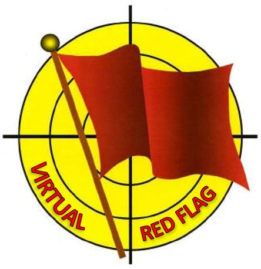

# VRF SPINS

**VER 1.0 DEC 2019**

## TABLE OF CONTENTS

[CHAPTER 1 -- GENERAL. 5](#_Toc440437726)

[CHAPTER 2 -- AIRSPACE CONTROL PLAN.. 6](#_Toc440437727)

[CHAPTER 3 -- COMMUNICATIONS PLAN.. 7](#_Toc440437728)

[CHAPTER 4 -- AIR-TO-AIR REFUELLING OPERATIONS. 15](#_Toc440437734)

[CHAPTER 5 -- COMBAT SEARCH and RESCUE (CSAR)  16](#_Toc440437735)

[CHAPTER 6 -- AIR OPERATIONS. 22](#_Toc440437736)

[CHAPTER 7 - OPERATIONS IN SUPPORT OF GROUND FORCES. 24](#_Toc440437737)

[CHAPTER 8 -- DYNAMIC TARGETING OPERATIONS. 26](#_Toc440437738)

[CHAPTER 9 -- AIR-TO-AIR OPERATIONS. 29](#_Toc440437739)

[CHAPTER 10 -- SEAD OPERATIONS. 31](#_Toc440437740)

[CHAPTER 11 -- RECCE OPERATIONS. 32](#_Toc440437741)

[CHAPTER 12 -- FRIENDLY SBAD OPERATIONS. 32](#_Toc440437741)

[CHAPTER 13 -- TLP RULES OF ENGAGEMENT. 33](#_Toc440437742)

[CHAPTER 14 -- ROLES AND RESPONSIBILITIES. 40](#_Toc440437743)

## CHAPTER 1 -- GENERAL

1.1 GENERAL. VIRTUAL RED FLAG SPINS AMPLIFY RED FLAG ATO (AIR TASKING ORDER). PROCEDURES DETAILED IN THESE SPINS DO NOT REFLECT CURRENT, REAL WORLD OPERATIONS.

1.2 AIRSPACE CONTROL PLAN. .

1.3 COMMUNICATION PLAN. CHAPTER 3 OF THE SPINS COVERS THE VRF COMMUNICATIONS PLAN. DETAILS ON THE COMM PLAN (INCLUDING IDM) WILL BE PUBLISHED IN THE DAILY ATO.

1.4 RULES OF ENGAGEMENT. THESE SPINS ALSO CONTAIN AMPLIFIED RULES OF ENGAGEMENT.

## CHAPTER 2 -- AIRSPACE CONTROL PLAN                                                               

**2.1** THESE INSTRUCTIONS AMPLIFY, AND WHERE NECESSARY OVERRIDE, THE PROCEDURES IN THE ACTIVE ACO.

**2.2** LABELS, ALTITUDES AND DIMENSIONS IN ACO ARE IN ACCORDANCE WITH NEW DOCUMENTS THAT WILL BE RELEASED SOON.

**2.3** AIRSPACE DEFINITIONS:

**2.3.1** **FREE FIRE AREA (FFA):** AN AREA INTO WHICH ANY WEAPON SYSTEM MAY FIRE WITHOUT ADDITIONAL COORDINATION WITH THE HEADQUARTERS.

**2.3.2 RESTRICTED FIRE AREA (RFA):** AN AREA INTO WHICH SPECIFIC RESTRICTIONS ARE IMPOSED AND INTO WHICH FIRES THAT EXCEED THOSE RESTRICTIONS ARE PROHIBITED WITHOUT PRIOR COORDINATION.

**2.3.3 NO-FIRE AREA (NFA):** AN AREA IN WHICH FIRES OR THE EFFECTS OF FIRES ARE NOT ALLOWED WITHOUR PIOR CLEARANCE FROM THE ESTABLISHING HEADQUARTER.

**2.3.4 RESTRICTED OPERATIONS AREA (ROA**): AIRSPACE DESIGNATED BY THE AIRSPACE CONTROL AUTHORITY, IN RESPONSE TO SPECIFIC OPERATIONAL SITUATIONS/REQUIREMENTS WITHIN WHICH THE OPERATION OF ONE OR MORE AIRSPACE USERS IS RESTRICTED.

**2.4 BULLSEYE POINTS.** THE BULLSEYE FOR VRF MISSIONS WILL BE DETAILED IN THE ATO. THE BULLSEYE CANNOT BE CHANGED WITHOUT VRF STAFF APPROVAL.

**2.5 COORDINATES FORMAT.** TLP ASSETS ARE TO USE WGS84 LAT LONG CENTESIMAL COORDINATES (EG N DD° MM.MMM' W DDD° MM.MMM').

## CHAPTER 3 -- COMMUNICATIONS PLAN                         

**3.1 FREQUENCIES.** ATO WILL CONTAIN ALL NECESSARY FREQUENCIES TO COMPLETE THE TACTICAL PART OF YOUR MISSION. MISSION COMMANDER (MC) IS RESPONSIBLE FOR MAKING A COMMPLAN FOR THE PACKAGE.

**3.2 CHECK-IN.** CHECK-IN WITH AIRSPACE CONTROL UNIT USING CALLSIGN AND LOCATION FROM A BULLSEYE REFERENCE POINT. FLIGHT LEADS WILL CHECK-IN "AS FRAGGED" IF ALL ATO MSN TASKED AIRCRAFT ARE AIRBORNE. IF DIFFERENT THAN "AS FRAGGED", SPECIFY "FRAGGED MINUS ...".

**3.3  AUTHENTICATION.** PRIMARY MEANS OF AUTHENTICATION IS THE VRF TRAINING AMSL 1800. SECONDARY MEANS IS RAMROD.

**3.3.1 RAMROD WORDS**.

**3.3.2. AMSL 1800**

** E.g: "Chalis, Spartan 1, Authenticate A, P, U" / "Chalis, authenticate Z"**

**3.4  ****CODEWORDS. **FOR REASONS OF OPSEC, CODEWORDS SHOULD BE USED TO THE MAX EXTENT POSSIBLE.

**CHATTERMARK**

**- PRIMARY**

**- SECONDARY**

3.5 HAVEQUICK. NOT APPLICABLE.

**3.6 LINK 16 NETWORK.** THE NETWORK USED AT VIRTUAL VRF IS STANDARD  DCS .

**3.6.1 DOMESTICS.**

**3.6.1.1 STARTUP.** PARTICIPANTS WILL INITIATE SYNCHRONIZATION ON THE VIRTUAL RED FLAG RAMP USING NORMAL POWER MODE. PARTICIPANTS WILL REPORT TIMBER SWEET ON AWACS FREQUENCY.

**3.6.1.2 AIR CONTROL INITIATION.** MC WILL ASSIGN DIGITAL CONTROL OF THE NETWORK. NORMALLY WILL BE MISSION HOST, MC IF CONNECTION CAPABLE.

**3.6.1.3 ALPHA CHECK.** ALPHA CHECK WILL BE DONE BY THE AWACS IN THE CEHCK-IN FREQUENCY.

**\
PHOTO**

**BOGEY**

**BANDIT**

**HOSTILE**

**ROLEX**

**SPIN**

**SLIP**

 |

**SEAD BREVITY WORDS

**

REQUEST FOR SEAD EOB PICTURE/UPDATE

**C2 BREVITY WORDS**

A RADAR OR VISUAL AIR CONTACT WHOSE IDENTITY IS UNKNOWN

AN AIRCRAFT IDENTIFIED AS ENEMY IAW THEATRE ID CRITERIA. THE TERM DOES NOT NECESSARILY IMPLY DIRECTION OR AUTHORITY TO ENGAGE

1.  (AIR-GEN) AN AIR CONTACT POSITIVELY IDENTIFIED AS ENEMY IN ACCORDANCE WITH THEATRE RULES OF ENGAGEMENT UPON WHICH CLEARANCE TO ENGAGE IS AUTHORIZED

INFORMATIVE/DIRECTIVE CALL INDICATING A TIME CHANGE IN MINUTES FROM A GIVEN DATUM. THE TERM "PLUS" WILL INDICATE LATER TIME AND THE TERM "MINUS" WILL INDICATE AN EARLIER TIME (ROLEX PLUS 2" MEANS TWO MINUTES HAVE BEEN ADDED TO THE DATUM TIMES).

***

***

DIRECTIVE/INFORMATIVE CALL TO EXECUTE A PREBRIEFED TIMING/ SPACING MANOEUVRE (EXAMPLE: SPIN 10' IMPLIES THAT EVERY CONCERNED FORMATION MUST ADD 10 MINUTES TO THE TIME ON THE CURRENT REFERENCE POINT)

***NOTE: REFER TO VRF SOP TO USE BEST SPIN OPTIONS WITH MISSIONBOARDTOOL***

INFORMATIVE OR DIRECTIVE CALL INDICATING THE ATTACKER

WILL ATTACK THE TARGET AT THE PLANNED ALTERNATE TOT (EXAMPLE: SLIP A = TOT 14:20, SLIP B = TOT 14:24) OR INDICATING TIME DELAY TO INDIVIDUAL FLIGHT/ELEMENT EVENT (EXAMPLE "SPARTAN #2 FROM LEADER, SLIP 2 MINUTES").

***NOTE: REFER TO VRF SOP TO USE BEST SLIP OPTIONS WITH MISSIONBOARDTOOL***

 |

**3.7** **BREVITY WORDS**. BREVITY WORDS WILL BE USED ALWAYS IT IS POSSIBLE. BREVITY WORD WILL BE STANDARD DOCUMENTS IN USE.

**\
**

**CHAPTER 4 -- AIR-TO-AIR REFUELLING OPERATIONS**

**4.1. ****TASKING. **VIRTUAL RED FLAG MISSIONS REQUIRING AIR-TO-AIR REFUELLING WILL BE TASKED BY VRF STAFF THROUGH THE ATO.

**4.2. ****PROCEDURES.** AAR PROCEDURES WILL BE IAW PLANNING PHASE.

**\
**

CHAPTER 5 -- AIR OPERATIONS                                                                     
===============================================================================================

**5.1 MISSION RISK LEVELS**. ATO SHOULD BE ANNOTATED WITH A NOTIONAL MISSION RISK LEVEL. MISSION PLANNING, INCLUDING (EXERCISE) CANCELLATION CRITERIA, SHOULD BE COMMENSURATE WITH THE FOLLOWING:

|

** RISK LEVEL**

 |

**DEFINITION OF MISSION RISK LEVELS**

 |
|

**HIGH**

 |

A. THE MISSION IS VITALLY IMPORTANT TO THE OVERALL SUCCESS OF THE CAMPAIGN.

B. POTENTIAL LOSSES ARE ASSUMED

 |
|

**MEDIUM**

 |

A. THE MISSION IS IMPORTANT TO THE OVERALL SUCCESS OF THE CAMPAIGN.

B. EVERY ATTEMPT TO MINIMIZE LOSSES SHOULD BE MADE.

C. SEAD IS NOT REQUIRED IF MEZ ENTRY IS NECESSARY TO ACHIEVE THE TASK.

 |
|

**LOW**

 |

A. THE MISSION IS ONLY IMPORTANT WITHIN THE CONTEXT OF THE SHORT TERM SITUATION.

B. LOSSES ARE NOT ACCEPTABLE.

C. FORCES CAN PUSH UP TO BEING THREATENED BY AIR OR SURFACE THREAT WEAPONS ENGAGEMENT ZONES.

D. TO ENTER KNOWN MEZ'S, SEAD COVERAGE IS MANDATORY

 |

**5.2 TARGET PRIORITY GRADES**. TARGETS WILL BE ANNOTATED WITH A PRIORITY GRADING IN THE ATO.

|

**PRIORITY**

**GRADE**

 |

**DEFINITION OF TARGET PRIORITY GRADE**

 |
|

**1**

**CRITICAL**

 |

CRITICAL

 |
|

**2**

**IMORTANT**

 |

IMPORTANT

 |
|

**3**

**ENABLING**

 |

ENABLING

 |
|

**4**

**POTENTIAL**

 |

POTENTIAL

 |
|

**5**

**SUCCESSFUL ACHIEVEMENT OF DESIRED EFFECT**

 |  |

**\
**

CHAPTER 6 - OPERATIONS IN SUPPORT OF GROUND FORCES      
========================================================

6.1 CLOSE AIR SUPPORT MISSIONS.
-------------------------------

**6.1.1 TASKING**. ALL CAS MISSIONS ARE TO CHECK IN WITH THE AIRBORNE COMMAND ELEMENT (ACE). ACE WILL PASS ALL MISSIONS TO TACP FOR DECONFLICTION AND FLOT PASSAGE.

**6.1.2 ****CAS MISSIONS.** CAS AIRCREWS MUST USE ALL MEANS AVAILABLE TO PID TARGETS (AS REQUIRED) PRIOR TO WEAPONS RELEASE.

**6.1.3 ****BOMB ON COORDINATES** **(BOC)** FAC WILL SAY COORDINATES TO AIRCREW. AIRCREW ARE ALLOWED TO DROP BOMBS IF THEY REPEAT THE COORDINATES VIA RADIO COMMS.

**6.1.4 ****BOMB ON TARGET** **(BOT)** AIRCREW SHOULD HAVE TALLY WITH THE TARGET

**6.1.5 ****WEAPON EMPLOYMENT**. AIRCRAFT COMMANDERS ARE TO ENSURE THAT THE MINIMUM SAFE DISTANCE FROM TROOPS AND FRIENDLY FORCES IS OBSERVED PRIOR TO WEAPON RELEASE.

**CHAPTER 7 -- DYNAMIC TARGETING OPERATIONS**

**7.1 DT TASKING. ** A DYNAMIC TARGETING MISSION IS TASKED WHEN POSSIBLE TARGETS CAN NOT BE PROSECUTED INTO THE STANDARD ATO CYCLE.

**7.1.1 TARGET IDENTIFICATION. **DEPENDING ON THE TASKING AIRCREW ARE RESPONSIBLE FOR POSITIVE TARGET IDENTIFICATION.

THE TASKING CAN BE:

- INVESTIGATE

- TARGET

- STRIKE

- SMACK

**7.1.3 ACCURACY OF COORDINATES. **ACCURACY WILL BE LOW, MEDIUM OR HIGH.

8.1.3.1 **LOW** IS FOR AREA COORDINATES

8.1.3.2 **MEDIUM** IS FOR COORDINATE ACCURACY LESS THAN 200FT.

  8.1.3.3**  HIGH** IS FOR MENSURATED COORDINATES.

**7.2 VRF STRIKE COODINATION AND RECCE (SCAR) PROCEDURES.**

MISSIONS TASKED AS SCAR COMMANDER WILL DECONFLICT OTHER ASSETS IN/OUT THE DEFINED OPERATING AREA. AIRCRAFT JOINING WILL CONTACT THE SCAR COMMANDER FOR DECONFLICTION AND JOINING DETAILS. 

USE ANNEX M FOR SCAR FORMAT

*\
*

CHAPTER 8 -- AIR-TO-AIR OPERATIONS                                                                  
===================================================================================================

**8.1 REFERENCE DOCUMENTS **FOR AIR TO AIR OPERATIONS BESIDES VRF SPINS ARE DOCUMENTS IN EFFECTS GENERATED BY VIRTUAL RED FLAG STAFF OF THOSE GENERATED BY THE SQUADRONS PARTICIPATING IN THE VIRTUAL VRF.

**8.2 IDENTIFICATION OF AIRBORNE TARGETS.**

** 8.2.1 IDENTIFICATION CRITERIA** WILL BE SPECIFIED IN THE ROE SECTION OF THE VALID TTO REFERENCING THE 23 SERIES IN CHAPTER 12.

** 8.2.2 HOSTILE ACT/HOSTILE INTENT**.

 **8.2.3** **AUTHORITY TO DECLARE TRACK IDENTITIES.** AWACS WILL BE REPONSIBLE OF DECLARATION.

**8.3 ENGAGEMENT OF AIRBORNE TARGETS.**

** 8.3.1 AUTHORITY TO ORDER ENGAGEMENT**. AWACS WILL BE THE AUTHORITY TO ORDER ENGAGEMENTS.

** 8.3.2 CLEAR FIELD OF FIRE** MUST BE ASSURED PRIOR TO ANY AIR-TO-AIR WEAPONS RELEASE. AIRCRAFT COMMANDERS WILL USE THEIR NATIONAL CRITERIA.

** 8.3.3 SPECIFIC ENGAGEMENT CRITERIA** WILL, IF NECESSARY, BE SPECIFIED IN THE ROE SECTION OF THE VALID ATO.

**\
**

CHAPTER 9 -- SEAD OPERATIONS                                                                            
=======================================================================================================

9.1 SUPPRESSION OF ENEMY AIR DEFENCE (SEAD) MISSIONS. SEAD IS AN ACTIVITY THAT NEUTRALIZES, TEMPORARILY DEGRADES OR DESTROYS ENEMY AIR DEFENCES BY DESTRUCTIVE AND/OR DISRUPTIVE MEANS.
---------------------------------------------------------------------------------------------------------------------------------------------------------------------------------------

9.2 NON-LETHAL SEAD. JAMMING OF ENEMY RADARS AND COMMUNICATIONS IN SUPPORT OF ALL FRIENDLY OPERATIONS.
------------------------------------------------------------------------------------------------------

9.3 LETHAL SEAD. THE MEANS OF EMPLOYING ANTI-RADIATION MISSILES (ARMS) TO INFLICT LETHAL SEAD ARE DESCRIBED BELOW.
------------------------------------------------------------------------------------------------------------------

**9.3.1 PRE-EMPTIVE ARM EMPLOYMENT. **PRE-PLANNEDFIRING OF ARMS AGAINST THREAT SYSTEMS IN A KNOWN LOCATION.

**9.3.2 ****REACTIVE ARM EMPLOYMENT. **FIRING OF ARMS IN REACTION TO AN EMITTING THREAT SYSTEM. THREAT SYSTEM EMISSIONS MAY BE DETECTED BY ON-BOARD SENSORS.

**9.4 DESTRUCTION OF ENEMY AIR DEFENCES (DEAD) MISSIONS.** 

**9.4.1 PRE-EMPTIVE DEAD**: EMPLOYMENT OF AIR TO GROUND WEAPONS, OTHER THAN ARMS, AGAINST SAM, AAA AND RADAR SYSTEMS SUPPORTING ENEMY AIR DEFENCE.

**9.4.2 REACTIVE DEAD:**EMPLOYMENT OF AIR TO GROUND WEAPONS, OTHER THAN ARMS, IN REACTION TO AN EMITTING THREAT SYSTEMWHICH POSES AN IMMEDIATE THREAT TO FRIENDLY FORCE OPERATIONS. 

**9.5 SEAD/DEAD TASKING: **NON LETHAL/LETHAL SEAD MISSION WILL BE TASKED AS SEAD IN THE ATO.

**\
**

CHAPTER 10 -- RECCE OPERATIONS          
=======================================

**10.1 RECCE MISSIONS.** EXPECT TASKING FROM THE ATO.

**CHAPTER 11 -- FRIENDLY SBAD OPERATIONS**

**11.1** SBAD ARE PART OF THE DEFENSIVE COUNTER AIR MISSION. ATO WILL GIVE TO AIRCREW THE FRIENDLY SBAD WEAPONS CONTROL STATUS.

**\
**

CHAPTER 12 --VIRTUAL RED FLAG RULES OF ENGAGEMENT                                          
==========================================================================================

THE RULES OF ENGAGEMENT WILL BE SHOWN IN THE ATO WHICH WILL BE DELIVERED TO MC BEFORE PLANNING PHASE STARTS.

**\
**

ANNEX A. RED RULES
==================

RED RULES WILL BE BRIEF TO RED ASSETS PRIOR EACH MISSION. VRF STAFF WILL REPONSIBLE OF DOING THIS TASK.

**ANNEX B. KILL REMOVAL/REGEN**

IF ANY PLAYER, BLUE OR RED, RECEIVES A KILL, HE WILL PROCEED AS FOLLOWS:

**BLUE PLAYER:**

1\. CLIMB OR DESCEND TO 9000'-10000' AGL

2\. SET HEADING 090º

3\. CALL ON UHF #17 (267.000)

- CALLSIGN

- B/E POSIT + ALTITUDE

- STATUS = KILLED

4\. EXPECT ACKNOWLEDGE FROM GCI

5\. CROSS THE FLOT EASTBOUND AND:

- GO TO AAR WITHOUT INTERFERING WITH THE MISSION

- PROCEED TO HOME BASE AND PERFORM TRAFFIC PATERN

- RTB AND FULL STOP LANDING

EXAMPLE:

BRONCO52: "BRONCO 52, BULLSEYE 320/20, 31.000', KILLED"

GCI: "PEGASO, ROGER, BRONCO 52 KILLED"

**RED PLAYER:**

1\. CLIMB OR DESCEND TO 9000'-10000' AGL

2\. SET HEADING 270º TILL LEAVING THE COMBAT

3\. PROCEED TO YOUR MOB (MAIN OPERATION BASE: THE BASE WHERE YOU

TOOK OFF)

4\. CALL 0N VHF #17 (138.000)

-CALLSIGN

- B/E POSIT + ALTITUDE

- STATUS = KILLED

5. EXPECT ACKNOWLEDGE FROM GCI

**RED REGEN**

INSTRUCTIONS:

- ALL RED PLAYERS ARE ALLOWED TO SHOT ONLY 4 MISSILES THE FIRST 20

MINUTES FROM THE BEGINNING OF THE VULTIME.

- WHEN KILLED, PROCEED TO YOUR MOB, PERFORM A TOUCH AND GO AND

JOIN THE COMBAT. THERE IS A RESTRICTION OF 4 MISSILE PER LIVE.

- IF YOU FIRE ALL YOUR MISSILES, PROCEED TO YOUR MOB AND "KILL

REMOVE"
